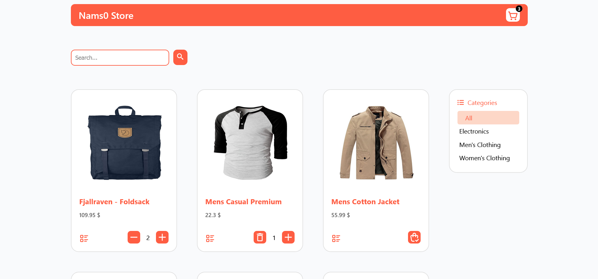
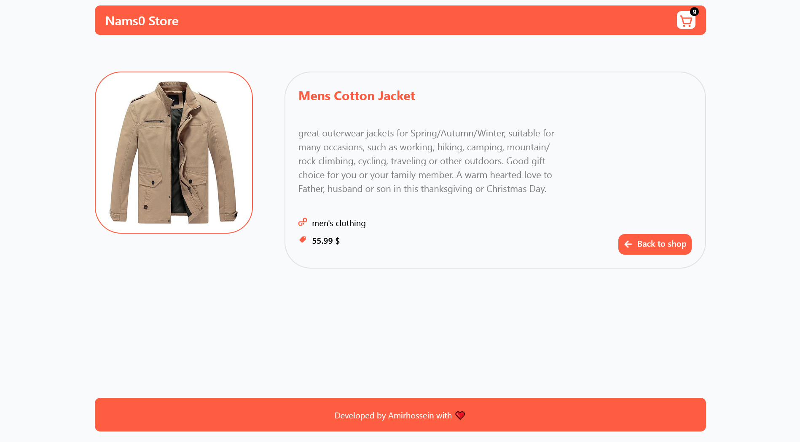
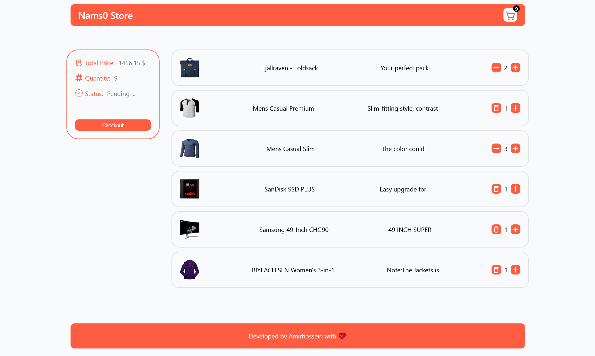

Here’s an improved and more polished version of your README, with a clearer structure, better flow, and a note about it being a **single-page application (SPA)**:

---

# 🛒 E-Commerce Store (Single Page Application)

A modern, responsive **single-page e-commerce application** built with **React**. This project allows users to seamlessly browse a catalog of products, manage their shopping cart, and initiate checkout—all within a clean, intuitive interface.

---

## 🚀 Project Overview

This React-based SPA (Single Page Application) simulates a fully functional online store. It features a dynamic product catalog, detailed product views, persistent cart management, and real-time search and filtering.

---

## ✨ Features

### 🛍 Product Catalog

- Browse products
- Filter by category
- Search by product name
- View detailed product information

### 🛒 Shopping Cart

- Add, remove, and update item quantities
- Persistent cart using `localStorage`
- Clear and accessible checkout flow

### 💡 User Interface

- Fully responsive and mobile-friendly
- Smooth navigation with React Router
- Empty cart messaging and loading indicators

---

## 🧰 Tech Stack

- ⚛️ **React** (Hooks-based architecture)
- 🔁 **React Router** for client-side routing
- 🌐 **Context API** for global state management
- 🗄 **localStorage** for data persistence
- 📡 **Axios** for API requests
- 🎨 **CSS Modules** for modular styling
- 🎧 **React Icons** for modern iconography

---

## 📁 Project Structure

```
src/
├── components/     # Reusable UI components
├── context/        # Global state/context providers
├── helpers/        # Utility functions
├── pages/          # Page components (Home, Product, Cart, etc.)
├── services/       # API config and data fetching
├── App.js          # Root component with routing
└── index.js        # Application entry point
```

---

## 🔌 API Integration

Product data is fetched from the [Fake Store API](https://fakestoreapi.com). Configuration is handled in `src/services/config.js`.

## 📸 Screenshots

### 🏠 Home Page



### 🧾 Product Detail



### 🛒 Cart View


